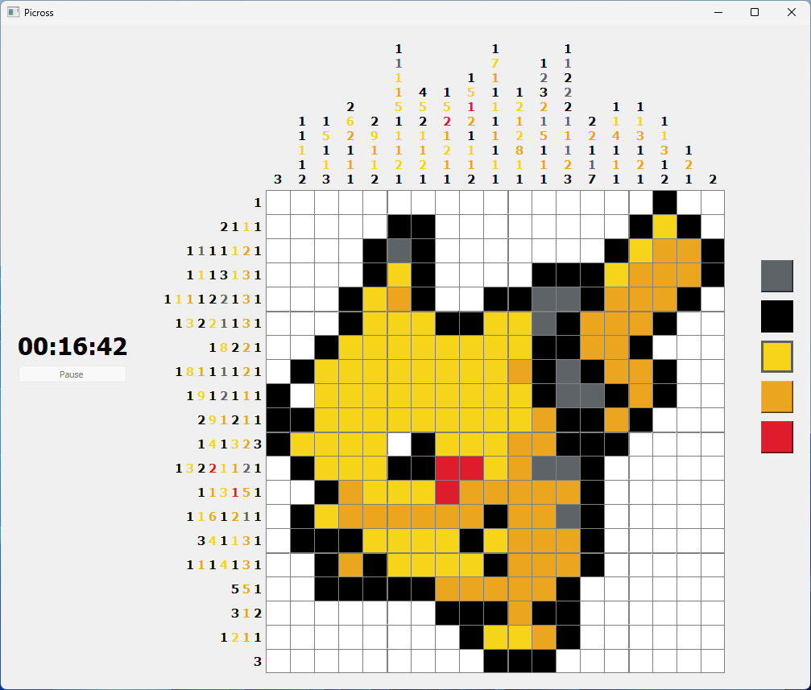

## Project

This project is an implementation of the famous Picross (also known as nonogram) game.
It was especially developped to include the following features:
- Play to the different grids provided or import new ones as .pix ASCII files
- Use the dynamically generated and user-friendly  GUI for more convenience
- Compatible with right clicks to uncheck or mark impossible cases as such
- Measurement of your completion time (including an anti-cheat pause button)
- Create new grids with the embedded editor (currenlty still under development)
- Learn how-to play with the interactive tutorial (currenlty still under development)

## Environement

This project is developped in C++11 (with an high focus on object oriented programming) and using Qt 5.15 for the GUI.

## Screenshots

